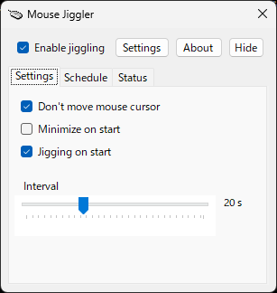

mousejiggler
============

Mouse Jiggler is a very simple piece of software whose sole function is to "fake" mouse input to Windows, and jiggle the mouse pointer back and forth.

Useful for avoiding screensavers or other things triggered by idle detection that, for whatever reason, you can't turn off any other way; or as a quick way to stop a screensaver activating during an installation or when monitoring a long operation without actually having to muck about with the screensaver settings.

What's custmized
----------------

- Some caption changed.
- More GUI settings.
  - Jigging on start option.
  - Time schedule option.



Portable Version
----------------

A portable version of Mouse Jiggler (i.e., one which does not require the .NET 5 runtime, and so can be installed on locked-down corporate machines that don't have it installed) is available on the releases page, as MouseJiggler-portable.zip. Just unzip and go.

**DO NOT USE THIS VERSION IF YOU HAVE ANY OTHER ALTERNATIVE.**

Let me put it to you this way. _Standard_ Mouse Jiggler, at the time of writing, is a single executable a mite under 1 MB in size. _Portable_ Mouse Jiggler is a folder of executables summing to approximately **83 MB**, for one of the most trivial applications imaginable, after all the assorted trimming-and-compressing magic is done. It's a bloated behemoth. If there is _any_ possibility that you will _ever_ run any other app that uses the .NET 5 runtime, you are much better off installing that and the regular version.

The only reason this exists is for those poor sods whose IT department makes it impossible to do that, and may their deities have mercy on their souls.

Operation
=========

Simply run the MouseJiggle.exe included in the release .zip file. Check the "Jiggling?" checkbox to start jiggling the mouse pointer; uncheck it to stop. The jiggle is slight enough that you should be able to use the computer normally even with jiggling enabled.

Check the "Settings..." checkbox to reveal the settings; these should be relatively self-explanatory. The 'Zen jiggle?' checkbox enables a mode in which the pointer is jiggled 'virtually' - the system believes it to be moving and thus screen saver activation, etc., is prevented, but the pointer does not actually move. This, however, may not work with a few applications which chose to implement their own idle detection.

To minimize Mouse Jiggler to the notification area, click the down-arrow button.

These settings are remembered from session to session. They can also be overridden by command-line options:

```
Usage:
  MouseJiggler [options]

Options:
  -j, --jiggle               Start with jiggling enabled.
  -m, --minimized            Start minimized (sets persistent option). [default: False]
  -z, --zen                  Start with zen (invisible) jiggling enabled (sets persistent option). [default: False]
  -s, --seconds <seconds>    Set number of seconds for the jiggle interval (sets persistent option). [default: 1]
  --version                  Show version information
  -?, -h, --help             Show help and usage information
```

The `-j` command-line switch tells Mouse Jiggler to commence jiggling immediately on startup.

Features That Will Not Be Implemented
=====================================

This is a list of feature requests which I've decided won't be implemented in Mouse Jiggler for one reason or another, along with what those reasons are, just for reference:

 * Autorun on startup (because that's what the Startup group, Task Scheduler, etc. are for; it's inelegant to duplicate system facilities in a minimal app).
 * Timed startup/shutdown (again, Task Scheduler is for this).

Support
=======

Mouse Jiggler is a free product provided without warranty or support.
